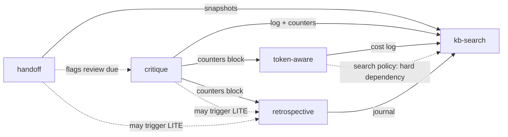

# instrumented_skills

[](LICENSE)


**One discipline, five skills: log state externally, read it back before acting, and
never let a suggestion pass as a decision.** Built for Claude Code and any other agent
surface with a persistent filesystem. Each skill works standalone; together they let
repeated work on the same target compound instead of restarting from zero every session.

| Skill | What it does | Status |
|---|---|---|
| [`critique/`](critique/) | Adversarial multi-lens review of a file, with memory: reads its own prior log before starting, so a second pass reconciles what changed instead of rediscovering it. | Ships complete |
| [`token-aware/`](token-aware/) | LLM cost reduction for prompts and pipelines. Deterministic arithmetic in Python, rates dated and source-tagged, refuses to compute against stale numbers. | Ships complete, 36 tests pass |
| [`retrospective/`](retrospective/) | Panel-style retros with anchored lenses, no finding without a quote, line, or named absence, and a cost lens that reports nothing rather than invents an ROI. Capture can be manual or automatic via a Stop hook. | Ships complete, optional capture hook |
| [`handoff/`](handoff/) | A structured end-of-session snapshot, schema instead of prose, so a decision and a suggestion can't blur together a few sessions later. Ships with a savings/lint toolkit and an optional session-length hook. | Ships complete, 55 tests pass |
| [`kb-search/`](kb-search/) | Ranked BM25 search over what the other four write. Standard library only, no LLM call. | Ships complete, tests pass (run for current count) |

A companion write-up on the reasoning behind these will be linked here once it's published.

## Status of this repo

All five ship complete: full protocols and references, each with a real, tested toolkit
behind it, not just a specification. `critique` and `kb-search` need nothing further.
`token-aware` needs `tools/rates.json` filled in with current, verified rates before its
numbers mean anything (it ships with placeholder rates and an intentionally-expired date,
see its `_comment` field, so the loader refuses to compute rather than return a silent
wrong number). `retrospective` and `handoff` each ship an optional hook
(`retrospective/scripts/retro_capture.py`, a Stop hook for automatic journal capture;
`handoff/tools/session_watch.py`, a UserPromptSubmit hook for session-length nudges) that
needs registering in `settings.json` to run automatically; both skills work without it,
using their manual modes. Run every test suite yourself before trusting the numbers, not
instead of running them; a count in prose drifts the moment a test is added. Check the
⚠️ / note sections in each skill's README before relying on it for anything load-bearing.

## Install

Each skill is a self-contained folder. On Claude Code or any surface with a persistent
filesystem, the fastest path is the install script at the repo root: it copies each
selected skill to `~/.claude/skills/`, archives whatever it replaces first, and (for
`token-aware`) runs its test suite as a sanity check afterward.

```bash
git clone <this-repo-url>
cd instrumented_skills

./install.sh                              # macOS/Linux, installs all five skills
./install.sh critique token-aware         # or just the ones you want
```

```powershell
.\install.ps1                                   # Windows, installs all five skills
.\install.ps1 -Skills critique,token-aware       # or just the ones you want
```

To copy a skill by hand instead, or onto a hosted chat surface with project-level
custom instructions, where you'd upload the folder's contents or paste `SKILL.md` plus
references into your project's instructions, just copy the folder:

```bash
cp -r instrumented_skills/critique ~/.claude/skills/
```

Or download the folder(s) you want directly from GitHub without cloning the whole repo,
using the "Download" option on an individual folder, or GitHub's zip download for the
full repository.

## How the skills connect

Each skill works standalone, but the set is designed to compose. Four of them write
durable artifacts (critique logs, retro journals, handoff snapshots, token-aware cost
logs); `kb-search` is the shared read-path over all of them, and `token-aware` owns the
policy that says when to use it.



Solid arrows are artifacts written and later read. Dashed arrows are a policy dependency
or a trigger signal, not data. In words:

- `kb-search` reads what the others write. `critique` reconciles a target against its own
  last log entry; `kb-search` lets a run ask whether the same root cause fired on any
  *other* target. A retro can check whether a long-horizon action was ever done; a handoff
  can search prior snapshots for what a past session settled. It defers one decision,
  grep-first versus escalate, to `token-aware/references/search_policy.md`, which is a hard
  dependency: install `token-aware` alongside it.
- `critique`'s log entries carry a `counters` block (calls, cap, bytes, out_chars, a SEV
  histogram, new findings, carried findings) alongside a top-level `promoted` flag.
  `token-aware/tools/cost.py`'s `cpd` subcommand reads it to compute effort-per-finding
  metrics with no currency conversion, useful specifically because not all work is billed
  per token. `retrospective`'s finance lens can use that same block as one of its
  admissible evidence sources when anchoring a cost-related finding.
- `retrospective` also exposes a LITE invocation path: a review or handoff skill can
  trigger a reduced-scale retro when its own condition fires (a review that closes out a
  project, a handoff that surfaces the same pattern a third time). `handoff`'s own
  protocol closes by running a review/critique skill against the snapshot itself, rather
  than performing that review inline, so a session ending with open SEV1/SEV2-equivalent
  issues does not silently defer them.

Every connection is read-only and, apart from kb-search's policy dependency, optional:
`critique` works standalone, and `token-aware` and `retrospective` fall back gracefully
when no counters data exists.

## Customising for your own setup

Every skill's README has an "Adapting this skill" section covering the parts that are
genuinely environment-specific: where logs live on your surface, how to add a lens or
persona, how to fill in current rates. The mechanism (log, reconcile, don't re-derive) is
meant to transfer directly; the specifics (paths, project names, current pricing) are
not, and are flagged everywhere they appear.

## License

MIT. See [`LICENSE`](LICENSE).
