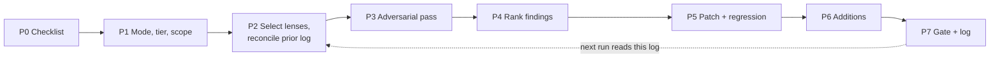

# critique

**A review that remembers what it already found, so the second pass costs less than the
first.**

Adversarial multi-lens review of a single file: a document, a prompt, or a code file.
The point that separates it from a one-off review is memory. Every run logs what it
found, and the next run on the same target reads that log first, so an already-diagnosed
defect is reconciled (FIXED, STILL-PRESENT, or WITHDRAWN) instead of rediscovered and
re-billed from scratch. A patch is not a fix until it is promoted, and the log tracks
that explicitly, so an unpromoted patch does not resurface as new findings next pass.

| | |
|---|---|
| **Protocol** | v2.5, 8 stages (P0 to P7) |
| **Lenses** | 5 always-on + bundle-specific (code, docs, systems, ml, multifile) |
| **Depends on** | nothing (standalone) |
| **Ships** | complete |

`SKILL.md` is the protocol. `bundles/` holds the lens definitions loaded by target type
(code, docs, systems, ml, multifile); each begins with `# Bundle:` and is trusted
config, not review data. `evals/` holds the regression-harness guidance you use when you
change the protocol or a bundle.

## The pipeline



The loop at the end is the whole point: P7 writes the log entry that P2 reads on the
*next* run against the same target. Nothing here happens twice for free.

## Install

Copy the folder to wherever your surface reads skills from, or use the repo-root install
script:

```bash
cp -r critique ~/.claude/skills/          # or: ./install.sh critique  (from the repo root)
```

On a hosted chat surface with no persistent filesystem, paste `SKILL.md` plus the
bundles you want into the project's custom instructions.

## Adapting this skill

Two settings are genuinely environment-specific, and `SKILL.md` points here for both.

**Where the log lives (P1).** On a surface with a persistent filesystem and a repo
(Claude Code, Cowork with a checkout), the log is
`${CLAUDE_PROJECT_DIR}/.claude/critique-log/<slug>.jsonl`, one file per target slug.
Where the filesystem does not persist (a hosted chat surface), the log lives in memory
instead: a general index for targets that span projects (shared skills, global config)
and a project-scoped index for targets that belong to one project. Decide the split once
per installation and name the projects that get their own index; it need not be every
project, only the ones with enough critique history to make cross-session reconciliation
worth it.

**Where the fix-everything preference lives (P5).** By default the skill patches SEV1 and
SEV2 and sends SEV3 to backlog. If you want it to also apply SEV3 and accepted additions
every run, set a standing fix-everything preference on your surface: a line in the
project's `CLAUDE.md` (or the equivalent always-loaded config) that the skill reads at
P5. Without that preference, request it per invocation instead.

**Lenses and bundles.** Each bundle under `bundles/` is a self-contained set of lens
definitions; add, remove, or reword one without affecting the others, and add a new
signature row to the P2 table in `SKILL.md` if you introduce a new target type. The
always-on five (purpose/product, evidence-integrity, falsification, pre-mortem, red-team)
are never dropped, so keep those out of the droppable-at-cap list.

## Regression testing

When you change `SKILL.md` or a bundle, do not judge a single run by eye. Run a fixed set
of targets through both the old and new version and compare. The three-case harness (a
clean document, a document with two planted defects, and a target with a prior unpromoted
log entry) is described in `evals/README.md`.
