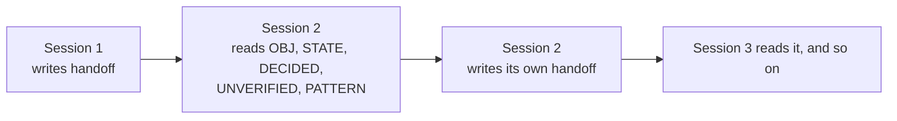

# handoff

**A decision and a suggestion read identically in prose. They don't in a schema.**

A structured end-of-session state snapshot, in place of a prose "here's where we left
off" recap. The schema exists because prose doesn't force you to separate a decision you
made from a suggestion you reacted well to. A few sessions later, those read the same,
and a plan you never actually committed to starts getting treated as settled.

| | |
|---|---|
| **Format** | 10-field schema, not prose |
| **Depends on** | nothing (pairs optionally with a review/critique skill) |
| **Ships** | `SKILL.md` is a reconstruction, see the note below |

## ⚠️ Note on this file

`SKILL.md` here is a **reconstruction**, built from a fully worked example of this
skill's output rather than from the original protocol file itself (which wasn't
available when this repo was scaffolded). The schema and field semantics match the
example closely; the exact wording of the rules is a best-effort draft. Read it, adjust
it to how you actually want it to behave, and don't assume it's verbatim anyone's
original. `example-handoff.md` is a sanitized worked example so you can see the schema
in use before writing your own real one.

## The schema

| Field | Holds |
|---|---|
| `OBJ` | One sentence: what the next session is resuming toward (sits under the header) |
| `STATE` | Verifiable facts about the artifacts: paths, versions, counts |
| `DECIDED` | Things actually committed to (high bar: a liked suggestion isn't a decision) |
| `CONSTRAINTS` | Hard limits the next session's work must respect |
| `PROPOSED` | Suggestions on the table, not yet committed |
| `REJECTED` | Options considered and dropped, with why |
| `OPEN` | Questions blocking a specific next step, naming what they block |
| `UNVERIFIED` | Claims carried forward that were never independently rechecked |
| `PATTERN` | Recurring issues, with an occurrence count |
| `FIRST` | The exact next action, singular, specific enough to execute directly |

## Why this compounds across sessions



Each session reads the last handoff before acting and writes its own before ending. A
claim that was never rechecked stays visible in `UNVERIFIED` instead of quietly becoming
fact; an issue that recurs shows up as a growing count in `PATTERN` instead of feeling
new every time.

## Why this shape

**DECIDED vs. PROPOSED** is the distinction that does the most work. It's tempting to
write "we're doing X" the moment an idea lands well in conversation, but that collapses
two different things: a firm commitment, and an option that was well-received. Keeping
them in separate sections means a future session (or a future you) can tell which is
which without re-reading the whole conversation for tone.

**UNVERIFIED** exists for long sessions specifically. Facts established early in a long
conversation get less reliable as the conversation goes on, not because anyone's being
careless, but because context degrades. This section is where a carried-forward claim
gets flagged as carried-forward, instead of silently being restated as current fact in
the next handoff.

**PATTERN** is what makes handoffs additive across a project instead of each one
starting cold. An issue that shows up once is a note. The same issue showing up in three
consecutive handoffs is a pattern worth acting on differently, and the occurrence count
is what makes that visible without you having to remember it yourself.

## Adapting this skill

The ten fields are a strong default, not a fixed requirement. If your work doesn't
produce REJECTED-worthy decisions often, for instance, you can leave that field
consistently `none` without removing it from the schema (consistency across handoffs
matters more than trimming unused fields). If you pair this with a review or critique
skill, the "Handoff to review" section in `SKILL.md` is the connection point: it flags
when a review pass is due without performing one itself, so the two skills stay
decoupled.

## Files

```
SKILL.md              the protocol (reconstructed, see the warning above)
example-handoff.md    a sanitized worked example for a generic web app project
```
