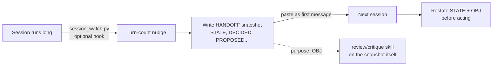

# handoff

**A schema for what happened, so "here's where we left off" stops meaning "trust me."**

A structured end-of-session state snapshot, in place of a prose recap. The schema exists
because prose doesn't force you to separate a decision you made from a suggestion you
reacted well to. A few sessions later, those read the same, and a plan you never actually
committed to starts getting treated as settled.

| | |
|---|---|
| **Protocol** | v3.0, 8 labeled sections, pipe-delimited fields, no prose |
| **Toolkit** | `tools/measure_savings.py` (lint, state-check, compare); `tools/session_watch.py` (optional session-length hook) |
| **Tests** | 55 pass |
| **Depends on** | nothing (PATTERN sourcing and the closing review step pair optionally with `critique`/`retrospective`) |
| **Ships** | complete |

`example-handoff.md` is a sanitized worked example that passes the linter below.

## From a long session to the next one acting correctly on turn one



Two loops close here: the next session verifies it actually absorbed the state before
acting, and the snapshot itself gets reviewed rather than trusted on the strength of its
own formatting.

## The schema

```
STATE          <=8 lines: paths (with version + line/byte counts), then installs, then running processes
DECIDED        <=10 lines: things actually committed to (high bar: a liked suggestion isn't a decision)
PROPOSED       <=6 lines: suggestions on the table, not yet committed
REJECTED       <=5 lines: options considered and dropped, with why
OPEN           <=5 lines: questions blocking a specific next step, naming what they block
UNVERIFIED     <=5 lines: claims carried forward that were never independently rechecked
PATTERN        <=3 lines: recurring corrections, with an occurrence count
FIRST          1 line: the exact next action, singular, specific enough to execute directly
```

Labeled lines, pipe-delimited fields, no prose paragraphs, no markdown headers. See
`SKILL.md` for the exact per-section line shape and the full rule set.

## Why this shape

**DECIDED vs. PROPOSED** is the distinction that does the most work. It's tempting to
write "we're doing X" the moment an idea lands well in conversation, but that collapses
two different things: a firm commitment, and an option that was well-received. The
protocol's own wording is blunt about this: fail toward under-claiming, and mark genuinely
unclear origin as `origin-uncertain` rather than guessing.

**UNVERIFIED** exists for long sessions specifically. `SKILL.md`'s own rule requires a
line stating the snapshot was authored under context degradation whenever a session runs
past roughly 30 turns. `tools/measure_savings.py --lint` checks that this line actually
got written, rather than trusting it happened.

**PATTERN** is what makes handoffs additive across a project instead of each one starting
cold, and it has a documented payoff: where a paired review/critique skill's findings log
exists, reading it for defects that recur across two or more runs gives you cross-session
pattern detection for free, since the log already exists and nothing else was reading it.

## Tools: measure_savings.py

The protocol makes a claim it flags as unverified: "estimated 30 to 40 percent fewer
tokens than prose... unmeasured", and a separate instruction it has no way to check on
its own: "compute [STATE line/byte counts]; do not estimate." Both are exactly the kind
of claim this repo's philosophy says shouldn't stay in prose. `tools/measure_savings.py`
closes both loops, plus a few structural checks the protocol states but doesn't enforce:

```bash
cd tools
pip install pytest --break-system-packages   # or without the flag, depending on your environment
python -m pytest -q                          # 55 tests across both tools

# Structural checks: section caps, FIRST singularity, header shape, and the
# long-session UNVERIFIED rule
python measure_savings.py your-handoff.md --lint

# Recompute STATE's claimed line/byte counts against the actual files on disk,
# flagging drift instead of trusting what was written
python measure_savings.py your-handoff.md --state-check --base-dir /path/to/project

# Turn "30-40%, unmeasured" into an actual number against a paired prose document
# covering the same content (both estimated with the same char-per-token constant
# token-aware's toolkit uses, for a comparable figure, not a real tokenizer count)
python measure_savings.py your-handoff.md --compare prose-equivalent.md
```

`--state-check` only verifies path-shaped STATE rows (the ones with a version and
`<n>L <n>B`); install and process rows have nothing on disk to check against and are
skipped.

## Tools: session_watch.py

Answers "can something tell me when the session is getting long enough that I should
write a handoff and start fresh?": a `UserPromptSubmit` hook that counts turns
deterministically and states the count at 25 turns (soft) and 35 (direct).

The design point worth stating: this cannot be a `CLAUDE.md` rule alone. An instruction
like "tell me when this is getting long" asks the assistant to self-assess session
length, but it has no turn counter, and its sense of elapsed conversation is precisely
the faculty that degrades as the session grows. Detection belongs in code; `CLAUDE.md`
only says what to do once the signal arrives.

Four constraints from Anthropic's hooks reference shaped the implementation, and each
one changed the code:

- **Plain text, not JSON.** For this event stdout is added to context directly, and a
  known Claude Code issue surfaces a hook error to the user when `UserPromptSubmit`
  returns `hookSpecificOutput` JSON on a session's first prompt. Plain text avoids it
  and is officially supported here.
- **Factual phrasing, not imperative.** The reference warns that text framed as an
  out-of-band system command can trip prompt-injection defenses, causing the assistant
  to show it to you instead of acting on it. Every emitted string is a statement of
  fact; the instruction lives in `CLAUDE.md`.
- **A 30-second timeout, blocking model processing.** The transcript is never fully
  JSON-parsed: lines are substring-prefiltered first, and the hook exits before opening
  the file at all once its last threshold has fired. Measured: 10.4 MB / 300-turn
  transcript counted in 33 ms, full invocation 68 ms.
- **The transcript lags the live conversation**, so the count is a floor. Messages say
  "at least".

It also had to be `UserPromptSubmit` rather than `Stop`: a Stop hook fires when the
session is already ending, too late to suggest wrapping up.

```bash
python -m pytest -q          # 55 tests across both tools

# Verify installation (silent-by-design means broken and working look identical
# until turn 25, so check explicitly):
echo '{"transcript_path":"/path/to/transcript.jsonl","session_id":"test"}' \
  | HANDOFF_WARN_TURNS=1 python3 tools/session_watch.py
```

Swap in a real transcript path: Claude Code writes them under
`~/.claude/projects/<project-slug>/*.jsonl`, and any real one works. The placeholder path
above produces the same silent, exit-0 output as a broken install, which is exactly the
ambiguity the next paragraph describes.

The hook fails open on every error path (malformed input, missing transcript,
unwritable state directory), because a hook that raises could interfere with prompt
submission. That safety property is also what makes silent failure possible, which is
why `CLAUDE_md-snippet.md` ships a verification command and says when to re-run it.

## Insights from prior use

Patterns from real sessions using this skill and its companions:

- **Stating a savings or effort figure without measuring it** recurred across multiple
  sessions. This skill's own "30-40%, unmeasured" line is that pattern caught in the
  act, which is why `--compare` exists now rather than leaving the claim open.
- **Applying review rules to reviewed files while exempting the reviewer's own output**
  recurred too. It's why this skill's own example gets linted rather than trusted, and
  when it was, the shipped example failed on two counts (an invalid `session-length`
  value and a three-line `FIRST` against a cap of one).
- **The wrapper gets less scrutiny than the payload.** Two installer defects shipped
  this way in a prior session, both caught only after install. The hook here is wrapper
  code by that definition, so its test suite covers the failure paths (malformed stdin,
  missing transcript, unwritable state dir) more heavily than its happy path.
- **Silent-failure-by-design is a real risk, not a theoretical one.** A journal-capture
  Stop hook in a companion skill failed silently in a prior session and was noticed only
  when a downstream file showed a stale date. Any hook that fails open needs an explicit
  verification step, which is why `CLAUDE_md-snippet.md` ships one.
- **Two proposals surfaced twice and were never applied** until this pass: writing the
  snapshot around two-thirds through a session rather than at the end, and having the
  next session restate STATE before acting. Both are now rules in `SKILL.md`. A
  suggestion re-derived across sessions without ever landing is the exact waste the
  `critique` skill's promotion tracking exists to catch, appearing here in the handoff
  skill's own history.
- **The original design conclusion still holds**: a handoff transfers state rather than
  judging it, so multi-persona authoring multiplies tokens without producing orthogonal
  content. The win came from the schema, not from more sections or more voices.

## Files

```
SKILL.md                        the protocol
example-handoff.md              a worked example that passes measure_savings.py --lint
CLAUDE_md-snippet.md            session-length coordination: config, registration, verification
tools/measure_savings.py        lint, state-check, compare
tools/session_watch.py          UserPromptSubmit hook: turn counting and handoff signals
tools/test_measure_savings.py   23 tests
tools/test_session_watch.py     32 tests
```
