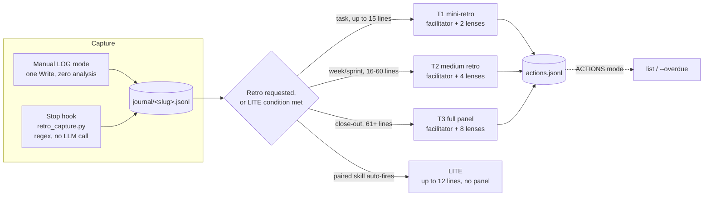

# retrospective

**Two ways to fill the journal, one discipline for turning it into a retro: no lens
reports a finding it can't point to evidence for.**

Structured retrospectives that compound instead of restarting from zero each time: a
fixed panel of lenses, each required to anchor its findings in something real, plus a
facilitator that sequences quieter perspectives before the dominant one so early findings
don't anchor everything that follows. Capture can be manual (LOG mode) or automatic (a
Stop hook that extracts marker lines from the transcript, no LLM call).

| | |
|---|---|
| **Protocol** | v1.2 |
| **Modes** | LOG, RUN (T1/T2/T3), ACTIONS, LITE |
| **Capture** | manual, or automatic via `scripts/retro_capture.py` (regex, stdlib only) |
| **Lenses** | 8 standing, each capped at 3 anchored findings |
| **Depends on** | nothing (LITE and the finance lens pair optionally with `critique`/`handoff`) |
| **Ships** | complete: protocol, panel reference, capture hook, all with real production use behind them |

## From a marker line to a panel finding



Pick a tier by stakes and scope, not by habit. A T3 panel on a routine weekly check-in is
wasted structure; a T1 mini-retro on a project close-out under-serves the questions that
actually need a debate.

## Marker vocabulary

Five line types, written at the start of a line (leading whitespace or a bullet is fine):

```
DECISION: <text> | expect: <expected outcome>   (expect required)
EVENT: <text>
RESULT: <text>
FRICTION: <text>
WIN: <text>
```

Typed by hand in LOG mode, or extracted automatically from the transcript by the Stop
hook: `DECISION` only from what the user actually wrote (never inferred from assistant
text), `EVENT`/`RESULT`/`FRICTION`/`WIN` from either user or assistant turns. A `DECISION`
with no `| expect:` clause anywhere in the transcript gets queued as a question instead of
guessed at, and the hook blocks the session's stop once so it can be asked before ending.

## Automatic capture: `scripts/retro_capture.py`

A `Stop` hook, stdlib only, no network call, no LLM call. Deterministic regex extraction,
not model-based summarisation: same input, same output, every time, and nothing to audit
for hallucinated markers.

**Register it** in `settings.json` (merge into the `hooks` object if you already run
other hooks; entries merge across settings levels rather than replacing):

```json
{
  "hooks": {
    "Stop": [
      {
        "hooks": [
          { "type": "command", "args": ["python3", "/absolute/path/to/skills/retrospective/scripts/retro_capture.py"], "timeout": 30 }
        ]
      }
    ]
  }
}
```

Use an absolute path and the `args` form (an argument array, not the `command` string
form: the two are mutually exclusive, a hook setting both is rejected at config load)
for the same reason `handoff`'s hook does: a bare `~` doesn't expand under PowerShell,
and the array form needs no quoting for paths with spaces.

**What it writes, and where:** one journal line per extracted marker, capped at 20 per
session, to `<project>/.claude/retro-log/journal/<slug>.jsonl`, where `<project>`
resolves from `$CLAUDE_PROJECT_DIR` or the hook's own `cwd` input. Slug defaults to the
project directory name; override with `RETRO_SLUG` for a name that doesn't match the
folder. Idempotent per session by exact `sid` match against the whole file, not a tail
scan, so a large journal never causes a session to be silently reprocessed.

**When extraction finds nothing**, a `zero-extract` line goes to
`retro-log/capture-errors.log` rather than the hook staying silent. That distinction
matters: a hook that fires but writes nothing looks identical to a broken hook from the
outside. In this skill's own development, that exact gap went undetected until the
diagnostic path was added in v2.4 (see the version history in
`scripts/retro_capture.py`'s module docstring).

## Storage

```
<project>/.claude/retro-log/
  journal/<slug>.jsonl      append-only capture, manual or hook-written, never rewritten
  actions.jsonl             one line per action; a status update appends a new line, last wins
  retros/<slug>-<date>.md   the retro documents themselves
  questions/<slug>.jsonl    gaps only the user can settle, drained one at a time
  capture-errors.log        hook diagnostics: true failures and zero-extract firings
```

`global` is a reserved slug for a cross-project retro: it reads the retro *documents* (not
journals) of the project roots named at invocation, and writes its own document into the
invoking project's store.

## Ground rules (binding at every RUN tier)

Kerth's Prime Directive: assume every decision was the best available given what was
known at the time. A decision is judged against its own `expect` field, not against the
outcome, so a good decision with a bad outcome and a bad decision with a good outcome are
both named as such rather than scored by hindsight. Every finding needs an anchor: a
journal line, a file, a diff, a log entry; a finding with no anchor is dropped. The
5-minute test: if it stays unclear what exactly would change after brief examination, the
finding is too vague to keep. Wins get equal weight to findings, named with the mechanism
that produced them so they're kept on purpose, not by accident.

## ACTIONS mode

`actions [slug|all] [--overdue]`: last-line-wins status per action id, sorted by due
date. No analysis beyond listing and flagging overdue items.

## LITE mode

Bounded mini-retro invoked from a paired review or handoff skill. `references/lite.md`
has the exact trigger test (a journal with recent activity is not enough on its own; the
condition needs a second signal, such as a critique finding recurring across runs or a
handoff's PATTERN section being non-empty) and the protocol: derive the slug, write up to
12 journal lines, append at most one action, report back in one line. Never opens the
full RUN machinery, never convenes the panel.

## Adapting this skill

**Wire the hook, or don't.** Automatic capture is optional; LOG mode alone (typed
markers, or a manual end-of-session sweep) is a complete way to use this skill without
installing `scripts/retro_capture.py` at all.

**The finance lens's anchoring rule is tool-agnostic**, per `references/panel.md`. It
names a paired skill's proxy stats (the `critique` skill's counters block, for example)
as one admissible cost source, but doesn't require that skill to be installed; point it
at your own tooling's proxy metrics, or let it fall back to timestamp-based timing.

**To add a persona**, define it in your project config with a `name` and a `mandate`,
following the worked example at the bottom of `references/panel.md`. It competes for a
lens slot like any standing lens, under the same 3-finding, anchors-mandatory rules.

**To change the lens set**, edit `references/panel.md` directly. Each lens is a
self-contained block of standing questions; changing one doesn't affect the others.

## Files

```
SKILL.md                    LOG/RUN/ACTIONS/LITE modes, storage schema, ground rules
references/panel.md         facilitator protocol + 8 lenses + project-persona extension point
references/lite.md          the LITE trigger test and protocol, for paired skills
references/formats.md       the retro document template
scripts/retro_capture.py    Stop hook: deterministic marker extraction, no LLM call
```
