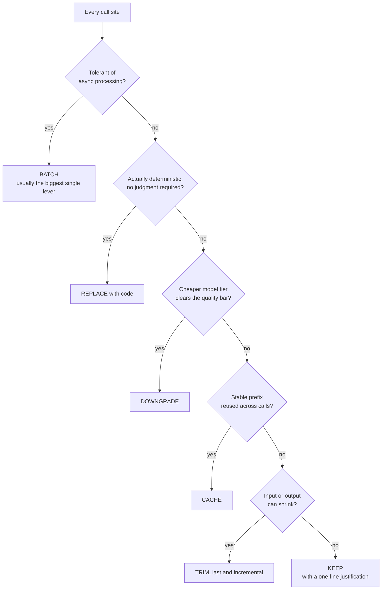

# token-aware

**Cost arguments settled by running Python, not by asserting a number in prose.**

Reduce LLM cost in prompts, pipelines, and code that calls an LLM, with the arithmetic
done in Python rather than asserted in prose. The toolkit exists because a hand-written
cache break-even claim once contradicted the multipliers printed right beside it.

| | |
|---|---|
| **Toolkit** | `tools/cost.py`, 7 subcommands, standard library only |
| **Tests** | 36 pass, run against fixture data, independent of `rates.json` |
| **Depends on** | nothing to install; `rates.json` must be filled in before real use |
| **Ships** | complete |

## ⚠️ Before you use this

**`tools/rates.json` ships as a template with placeholder rates and an intentionally
expired date.** Every model rate needs to come from Anthropic's current pricing page
before this is useful for real numbers. The loader refuses to compute anything until
`expires` is a real, future date, and the shipped template is deliberately already past
its (fake) expiry so that refusal is the first thing you see rather than a silent wrong
number. This is intentional: a skill that ships hardcoded rates is a skill that ships
stale rates the first time pricing changes.

## What it does, once set up

- `references/pricing.md`: rates, caching mechanics, and correct caching syntax, with
  every fact tagged by source class (first-party docs, locally measured, or secondary/
  aggregator) so a stale or unverified figure is visible rather than silently trusted.
- `references/audit_workflow.md`: the procedure for auditing an existing codebase's LLM
  calls: map without brute-force reading, rank by modelled cost, implement in decision
  order (below), report honestly including what the audit couldn't see.
- `references/prompt_rules.md`: construction rules for calls you write or review: no
  role-play preamble on extraction, `max_tokens` at the minimum plausible, `tool_use`
  over prompt-level JSON formatting where every provider in the path supports it.
- `references/module_layout.md`: where REPLACE functions, prompt builders, and the LLM
  client call site live in a codebase, plus the token-estimation constants and why the
  budgeting estimate and the truncation estimate deliberately use different ones.
- `references/python_replacements.md`: worked REPLACE patterns (threshold classification,
  score-to-label mapping, trend direction, keyword routing, weighted aggregation) with
  the accuracy-gate reasoning for the judgment-substitution cases.
- `tools/cost.py`: subcommands `cost`, `breakeven`, `compare`, `estimate`, `verify`,
  `render`, `cpd`, with a `--log` flag on `cost` that appends to `cost_log.jsonl`. Pure
  functions, no network calls, refuses to compute anything against an expired rate table.

## The decision order

Evaluate every call site in this order and stop at the first category that applies.
`audit_workflow.md` and `SKILL.md` § Decision order carry the full reasoning; this is the
shape of it.



`KEEP` is not a default. It is what is left after a call site survives the other five
checks, and it still needs its one-line reason recorded.

## Install

```
token-aware/
  SKILL.md
  references/pricing.md
  references/audit_workflow.md
  references/prompt_rules.md
  references/module_layout.md
  references/python_replacements.md
  tools/cost.py
  tools/test_cost.py
  tools/rates.json            <- fill in with current, verified rates
```

Copy the folder to wherever your surface reads skills from. The toolkit resolves
`rates.json` relative to its own folder, so run it from inside `tools/`:

```bash
cd token-aware/tools
pip install pytest      # or: pip install pytest --break-system-packages, depending on your environment
python -m pytest -q     # 36 tests, all pass regardless of what's in rates.json;
                         # they run against their own fixture data, not the shipped template
python cost.py render   # will refuse until rates.json has real, unexpired dates
```

## Adapting this skill

**Fill in `rates.json` first.** Read Anthropic's pricing page, fill in `models`, set
`verified` to today and `expires` to a real future date (a sensible default is the
sooner of a known upcoming rate change or 90 days out), and update `provenance` to
`first-party` with the URL you read. Leave any `modifiers` field `null` until you've
independently confirmed it. A null modifier is excluded from every calculation and named
in the output, which is the point: an under-estimate stays visible instead of silent.

**Then re-run `python cost.py render`** and paste the output into `references/pricing.md`
§ Rate snapshot, replacing the placeholder table. The snapshot is generated, not
hand-maintained, specifically so the copy in the reference file can't drift from the
canonical table in `rates.json`.

**Multi-provider routing.** If your calls go through more than one LLM provider,
`audit_workflow.md` § Step 4b and `prompt_rules.md` already flag the two places that
change: usage/token accounting typically only exists on the Anthropic leg, and
`tool_use`-based schema enforcement isn't portable, so keep the JSON-only prompt suffix
rather than pushing tool schemas into the router.

## The counters-proxy connection

`tools/cost.py`'s `counters_series()` function and `cpd` subcommand read the `counters`
block from a `critique`-skill log entry (see the `critique/` skill in this repo) and
derive calls-per-finding, bytes-per-finding, and re-derivation waste: cost-adjacent
metrics with no currency conversion applied, for surfaces (like a Max-style subscription)
where no per-call dollar figure is ever billed. This is the one place the two skills
share data, and it's read-only in this direction: `critique` logs raw counters,
`token-aware` is the only place that converts anything to cost.
